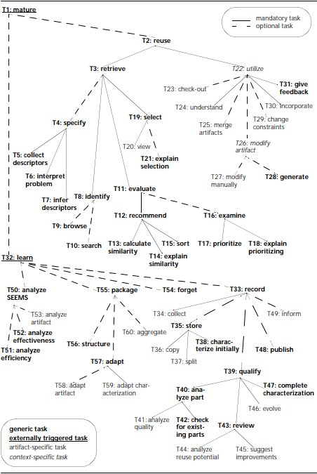
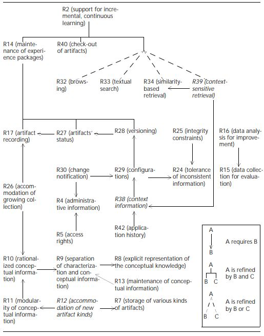
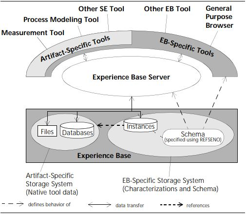

\newpage{}

# Zusammenfassung
In der vorliegenden Projektarbeit wird evaluiert, inwiefern die DISER Methodologie [@tautz_2001] geeignet ist um bei der COMPRA GmbH ein Software Engineering Experience Management System (SEEMS) zu entwickeln. Dieses System soll im Bereich der Softwareentwicklung des ERP Systems eEvolution und anderer Projekte der COMPRA GmbH Unterstützung bieten und in Form einer Experience Factory betrieben werden.
Es wird die aktuelle Situation des Experience-Managements und der Experience-Repositories sowie die gelebte Praxis und die Arbeitsweise bei der COMPRA GmbH analysiert.  
Weiterhin werden die Bestandteile der DISER Methodologie aufgezeigt und erläutert. Diese unterteilen sich in einen Repräsentationsformalismus für Wissen und Erfahrung REFSENO, die Entwicklungsstrategie für Experience Base Schemas GOODSEE, ein generelles Task Framework für den Aufbau und Betrieb einer Experience Base sowie eine Architektur für die technische Infrastruktur eines SEEMS.  
Das Ziel dieser und weiterführender Arbeit ist es, eine neue Experience Base bei der COMPRA GmbH aufzubauen.

\newpage{}

# Einleitung
Welche Vorteile bietet es, dediziertes Experience Management im Bereich der Softwareentwicklung zu betreiben?
Reicht es nicht aus, dass Wissen und Erfahrung im persönlichen Gespräch von Mitarbeiter zu Mitarbeiter weitergegeben oder sie sporadisch und in unterschiedlichsten Formen
in einem Netzwerk, in einer Quellcodeverwaltung oder einem DMS abgelegt werden?
Wie kann sichergestellt werden, dass das Wissen eines langjährigen Mitarbeiters nicht gänzlich verloren geht, wenn dieser das Unternehmen verlässt?

Diese einleitenden Fragen geben einen guten ersten Eindruck, warum Erfahrungsmanagement im Bereich Softwareentwicklung eine zentrale Rolle für die Produktivität der Mitarbeiter und die Qualität der entwickelten Software spielt.

@tautz_2001 beschreibt in der Einleitung, dass der größte Vorteil im Wettbewerb von Unternehmen in der Softwareentwicklung darin besteht, bessere Software mit mehr Features schneller und mit geringeren Kosten entwickeln zu können.
Dieses Know-How kann durch die Konkurrenz nicht imitiert werden, da es nicht von dem Softwareprodukt ableitbar ist.
Daraus lässt sich schließen, dass Experience Management im Software Engineering ein entscheidender Vorteil ist, um sich von der Konkurrenz abzusetzen.

\newpage{}

# Experience Factory

Eine Experience Factory ([@althoff_birk_1997] [@tautz_2001]) beschreibt eine Einheit in einem Softwareunternehmen, welche kontinuierliche und inkrementelle Verbesserung der Softwareentwicklung im Unternehmen erzeugen soll. Dies wird erreicht durch die Verarbeitung und Analyse aller Arten von Wissen und Erfahrung, welche im Kontext der Softwareentwicklung relevant sind.
Sie dient als ein Repository (Experience Base) für dieses Wissen und entspricht einer Fallbasis im Sinne von Case-Based-Reasoning. Weiterhin ist die Experience Factory zuständig für die Administration der Experience Base.  

In [@tautz_2001 Kapitel 1.1] wird das Konzept der Experience Factory durch einen Vergleich mit dem case-based-reasoning Zyklus und dem Paradigma QIP beschrieben.

Quality Improvement Paradigm ist ein früher Ansatz für iterative Qualitätsverbesserung von Softwareprojekten.  
QIP zielt darauf ab, schon in der Startphase eines Softwareprojektes festzulegen, welche Erfahrungen daraus gewonnen werden können und wie dies konkret erreicht werden kann.
QIP ist als eine Feedback Loop aufgebaut, welche durch die selbst auferlegten Ziele gesteuert wird. Im letzten Schritt von QIP wird die gewonnenen Erfahrungen in eine wiederverwendbare Form gebracht und aufbewahrt.  
Im Kontrast dazu ist der CBR Zyklus mehr technischer Natur, aber grundsätzlich zielen beide Ansätze auf das Gleiche ab: Ein Experience Model welches im Kontext der Softwareentwicklung wiederverwendet werden kann.

@basili_caldiera_rombach_2002 definieren die Experience Factory folgendermaßen:  

> The experience factory is a logical and/or physical organization that
supports project developments by analyzing and synthesizing all
kinds of experience, acting as a repository for such experience, and
supplying that experience to various projects on demand. It packages experience by building
informal, formal or schematized, and
productized models and measures of various software processes,
products, and other forms of knowledge via people, documents,
and automated support.

Die genannten Konzepte wurden in einer Zeit entwickelt, in welcher das häufigste Vorgehen in Softwareprojekten einer Form des Wasserfallmodells entsprach. Heutzutage, und auch bei der COMPRA GmbH, wird ein agiler Entwicklungsprozess bevorzugt.
Da CBR und QIP schon damals einer iterativen Funktionsweise zugrunde lagen wird deutlich, dass ein agiler, iterativer Entwicklungsansatz diese Arten von Prozessen noch viel besser einsetzen und einfacher Wert daraus gewinnen kann.
Im Vergleich zum Gebrauch in einem Wasserfallmodell werden die Erfahrungsinkremente bei einem agilen Prozess kleiner und frequenter, aber einfacher zu verarbeiten sein.

Folglich ist eine Experience Factory in den aktuellen agilen Entwicklungsprozess der COMPRA GmbH integrierbar.

\newpage{}

# Experience Repositories und Management

Bei der COMPRA GmbH werden verschiedene Softwaresysteme geführt, welche neben ihrer hauptsächlichen Funktion auch als Repository für Wissens- und Erfahrungsartefakte verwendet werden. Dies geschieht nicht zwangsläufig mit der Intention des Erfahrungsmanagement, sondern ist häufig eine Konsequenz aus Kommunikation und Kollaboration.
Nachfolgend werden alle Softwaresysteme genannt, welche in irgendeiner Form als Repository für Erfahrungsmanagement genutzt werden:

* MS Team Foundation Server:

    Source Control  
    Versioning  
    Build Server und Tools  
    Interne sowie externe Kollaborationsplattform zur Planung, Kommunikation und Dokumentation der Softwareentwicklung in allen Teams und Projekten  
    Projekt- oder Teambezogene Wikis  

* ELO Document Management System:

    Interne Dokumente (Personalmanagement, Gehaltsabrechnungen etc.)  
    Dokumentation von internen Prozessen und Vorgängen (Sprint Retrospektiven, Protokolle)  

* Windows File-Server:

    Ablage von verschiedensten Dateien und Dokumenten  
    Installationsdateien  
    Projektbezogene Dateien und Dokumente  

* ERP System eEvolution und MS SQL Server:

    Erstellung von Rechnungen  
    Dokumentation von Arbeitszeiten  
    Verwaltung und Organisation von Projekten  
    Verwaltung von Mitarbeitern und Kunden  
    CRM  

* [eEvolution Wiki:](https://www.wikierp.de/)

    Offizielles Wiki für das ERP System eEvolution  

* MS Teams:

    Interne und externe Kommunikation und Kollaboration (Chats, Meetings).  

* MS Sharepoint:

    Teamübergreifende Kalender, Dokumentation, Verschiedenes.  

* Yammer:

    Internes soziales Netzwerk  

* Email und IP-Telefon

Vergleichen wir diese Systeme mit den von Tautz aufgeführten vorhandenen Ansätzen für Erfahrungs-Repositories [@tautz_2001 Kapitel 5] wird deutlich, dass eine ganze Reihe bei der COMPRA GmbH im Einsatz sind:

* Controlled / Uncontrolled Keyword System
* Full Text Search auf vorhandene Repositories
* Hypertext
* Relational and Object-Oriented DBMS

Alle vorhandenen Repositories verfügen über die Möglichkeit über Full Text Search durchsucht zu werden.
Der Team Foundation Server (TFS) verwendet ein unkontrolliertes Keyword System, wobei jegliche Art von Workitem mit beliebigen Keywords versehen werden kann.
Das eEvolution Wiki ist eine Website (Hypertext), eEvolution ist ein ERP System, welches mit einer relationalen Datenbank betrieben wird, ebenso liegt dem TFS eine relationale Datenbank zugrunde.
Weiterhin sind einige Funktionalitäten des TFS (Umgang mit Workitems (User Stories, Issues, Features, Epics)) regelbasiert. Diese Regeln werden in Workitem und Workflow Templates definiert.

Es gibt kein System, welches logikbasiert, wissensbasiert oder mit irgendeiner Form von KI arbeitet.

##  Erfahrungsmanagement Ist-Situation

Zuvor wurden Erfahrungs-Repositories bei der COMPRA GmbH genannt.
In diesem Kapitel soll im Detail behandelt werden, wie die Repositories im Prozess der Softwareentwicklung eingebunden sind, welche Vor- und Nachteile dies beinhaltet und welche Maßnahmen nötig sind, um die Softwareentwicklung durch gezieltes Erfahrungsmanagement zu verbessern.

Das am häufigsten und am erfolgreichsten verwendete System bei der COMPRA GmbH ist der MS Team Foundation Server (TFS). Er wird als Source Control, Product Backlog sowie Kommunikations- und Kollaborationsplattform (intern und extern) verwendet.
Die COMPRA GmbH arbeitet nach einem agilen Manifest mit Scrum [@scrum_guide_2020]. Im TFS wird das Product Backlog zu jedem Team bzw. Kunden oder Projekt in Form von Features, User Stories und Issues gepflegt. An diesem Product Backlog sind alle relevanten Stakeholder beteiligt.

Nehmen wir nun an, ein Team steht vor einer neuen Softwareanforderung und möchte frühere Entwicklungen und Erfahrungen nutzen, welche bereits für andere Projekte in diesem Bereich gemacht wurden, um den Entwicklungsprozess in den Aspekten Kosten, Geschwindigkeit und Qualität zu verbessern.

Das bisherige übliche Vorgehen ist hierbei, zunächst den TFS über eine Full Text Search, Keywords oder gefiltert nach Attributen des Product Backlogs zu durchsuchen. Dies kann in manchen Fällen schnell relevante Product Backlog Items finden, jedoch nur, wenn der Suchende bereits Kenntnis über die Existenz der relevanten Backlog Items hat.
Ist keine Kenntnis darüber vorhanden, ist die Suche meist langwierig und ohne Erfolg.
Aus diesem Grund wird vor dem Schritt des Durchsuchens des Backlogs im persönlichen Gespräch mit anderen Mitarbeitern versucht, bereits zu filtern ob ähnliche Anforderungen in der Vergangenheit bereits existierten, für welches Projekt bzw. Kunden diese entwickelt wurden und welche Mitarbeiter darin involviert waren.
Mit diesen Informationen können die richtigen Kollegen angesprochen werden, um letztendlich die relevanten Backlog Items zu finden, sofern sie existieren.
Es ist vorgesehen, dass Backlog Items mit sämtlichen relevanten Informationen verknüpft sind. Dies beinhaltet Code Changesets, Dokumentationen jeglicher Art sowie sämtliche Kommunikation zum Backlog Item im Bezug auf Requirement-Engineering. In der Praxis ist dies leider nicht immer der Fall und auch hier sind wichtige Informationen oft nur über die involvierten Mitarbeiter zu finden.
Ein Problem dabei ist, dass wie oben beschrieben noch viele weitere Systeme als Experience-Repository verwendet werden und nicht alle Informationen im relevanten TFS Backlog Item gesammelt werden. Gibt es beispielsweise eine Installationsanleitung mit "lessons learned" aus vorherigen Projekten, welche aber in einem Projektordner auf einem File Server abgelegt ist, so muss der  Mitarbeiter erst auf diese Information hingewiesen werden.

Dies führt zu einer großen Belastung von gewissen Senior Mitarbeitern, welche den größten Erfahrungsschatz besitzen. Das Problem und die Auslastung wird noch viel größer, wenn der Mitarbeiter wiederholt aus verschiedenen Quellen nach den selben Informationen gefragt wird.

Um dieses Problem zu lösen, sollte ein einheitlicher Prozess für eine Experience Factory entwickelt werden, damit Artefakte in genau einem Repository zu finden sind und Mitarbeiter wissen, wie diese Artefakte dort abgelegt werden sollen.
Weiterhin muss die Experience Factory in die Entwicklungsprozesse integriert werden, damit die Experience Base kontinuierlich wächst und verbessert wird.
Wenn ein Mitarbeiter nach einer Information sucht muss klar sein wie und wo diese Information zu finden ist, sofern sie bereits im SEEMS existiert.

## Agiler Entwicklungsprozess

In diesem Kapitel wird der agile Entwicklungsprozess bei der COMPRA GmbH aufgezeigt und weiterhin ermittelt, wie der Betrieb einer Experience Factory in diesen integriert werden kann.

Die COMPRA GmbH setzt für die Komposition der Teams auf Full-Stack Teams. Das bedeutet, dass die einzelnen Teams zwar auf gewisse Bereiche spezialisiert sind, weil in diesen Bereichen einfach mehr Erfahrung vorhanden ist, grundsätzlich aber ein einzelnes Team alle Arten von Aufgaben oder Prozessen durchführen kann, welche in der Softwareentwicklung der COMPRA GmbH benötigt werden, also von der Akquirierung eines Projektes über Requirements-Engineering bis zum fertigen Softwareinkrement.
Dabei arbeiten die Teams nach einem agilen Manifest mit Scrum [@scrum_guide_2020], wobei hier bei allen Teams gewisse Details unterschiedlich gehandhabt werden, der Kernprozess aber der Gleiche ist.

Als Beispiel betrachten wir das Allstars Team mit dem Projekt Rossmann Central Europe.
Das Allstars Team entwickelt und betreut den Betrieb einer kundenspezifische Version des ERP Systems eEvolution 10 für Rossmann Ungarn und Rossmann Tschechien.
Das Team besteht aus einem Scrum Master, einem Product Owner von Rossmann Ungarn, einem Product Owner von Rossmann Tschechien und 5 Entwicklern sowie einem Auszubildenden.
Das Product Backlog im Team Foundation Server ist eine Liste von Features, User Stories und Issues und stellt die zentrale Quelle an Arbeit für das Team dar.
Ein Feature ist hier gleichzusetzen mit einem Product Goal und beschreibt den Zielzustand eines Teiles des Produktes bzw Systems. Um diesen Zielzustand zu erreichen werden User Stories unterhalb eines Features definiert, welche umgesetzt werden müssen um das Ziel des Features zu erreichen. Dabei sollten User Stories im Umfang idealerweise möglichst klein sein, damit sie innerhalb eines Sprints abgeschlossen werden können und der Aufwand besser abschätzbar ist.
Issues sind für ungeplante Arbeit, also Probleme welche während eines Sprints auftauchen und meist schnell gelöst werden müssen. Dies kann alle Arten von Problemen beinhalten welche durch das Scrum Team gelöst werden (Bugs, Support etc.).
Sprints werden grundsätzlich für eine Dauer von zwei Wochen geplant. Zum Ende eines Sprints werden sowohl ein Sprint Review, eine Retrospektive als auch ein Planning für den nächsten Sprint durchgeführt.  

Ausgehend von der oben beschriebenen Situation kann festgestellt werden, wie eine Experience Factory in den Prozess integriert werden kann.
Der erste Schritt zur Integration sollte sein, die Definition of Done eines Features, einer User Story oder eines Issues darum zu erweitern, das Wissen und die Efahrung aus diesem Workitem in den Prozess der Experience Factory einfließen zu lassen.
Weiterhin gilt es zu entscheiden, welche Mitarbeiter aktiv für den Aufbau und den Betrieb der Experience Factory zuständig sind und wie sich diese als Einheit oder Team in den Rest des Unternehmens einbindet.  

In [@tautz_2001] und [@althoff_birk_1997] wird die Experience Factory als eine eigene Organisationsstruktur mit dedizierten Experience Engineers beschrieben (siehe Abbildung 1).

  

Für die COMPRA GmbH als mittelständiges, agiles Unternehmen mit Full-Stack Teams ist es unangebracht, Experience Engineers in einem eigenen Team zu beschäftigen.  
Stattdessen sollte es pro Team einige wenige Mitarbeiter geben, welche die zusätzliche Rolle eines Experience Engineers einnehmen. Im Sinne von Agile würde dies im Unternehmen eher als eine Guild oder ein Chapter beschrieben werden.  
Eine Gilde ist eine Gruppe von Mitarbeitern aus verschiedenen Teams, welche gemeinsam an einem gewissen Thema oder einer Kompetenz arbeiten und sich regelmäßig dazu austauschen.
Die Konzepte von Guilds, Chapters und Tribes wurde erstmalig von Spotify eingesetzt, um Agile in großen Unternehmen besser skalierbar zu machen ([@kniberg2014] [@kniberg_ivarsson_2012]).  
Ziel einer Gilde ist es, Erfahrung auszutauschen und das Unternehmen als ganzes zu verbessern. Sie sind also auch in kleineren Unternehmen sinnvoll und werden bereits von der COMPRA GmbH eingesetzt. Beispielsweise gibt es eine Consultant-Gilde und eine Entwickler-Gilde.  
Die Ziele einer Gilde decken sich mit den Zielen der Experience Factory.

![Agile und Scrum bei Spotify [@wardt_2022]](https://agilescrumgroup.nl/wp-content/uploads/Spotify-Model-Guild-740x456.png)

Die einzelnen Mitglieder der Gilde sind also dafür verantwortlich die Erfahrung aus der Arbeit des eigenen Teams in die Experience Factory zu bringen, um dann gemeinsam mit der Gilde diese Artefakte zu analysieren und zu verpacken, damit das Wissen im Unternehmen wiederverwendbar ist.

\newpage{}

# DISER  

DISER (designing and implementing software engineering repositories) ist eine Methodologie für den Entwurf und die Implementierung eines Experience Management Systems im Kontext der Softwareentwicklung und zielt darauf ab, diesen Prozess effektiv und effizient zu gestalten.  
DISER soll eine Alternative zur üblich gelebten Praxis bieten, welche normalerweise daraus besteht, Kollegen zu befragen sowie manuell verschiedenste Datenquellen im Firmennetz zu durchsuchen.  
Die grundlegende Strategie von DISER ist dabei "learning from examples", welche bereits im Feld des Machine Learning erfolgreich angewendet wird. Erfahrungen aus vergangenen Softwareprojekten werden in einem System gespeichert und für die Wiederverwendung in anderen Projekten aufbereitet, um Probleme und Anforderungen in diesen Projekten effizienter und effektiver lösen zu können. Dabei wird das wiederverwendbare Wissen inkrementell erweitert und verbessert um ein kontinuierliches Lernen zu erreichen [@tautz_2001 Kapitel 1].  

## Task Framework
In [@tautz_2001 Kapitel 4] entwickelt Tautz ein allgemein gültiges Task Framework für den Aufbau und Betrieb einer Experience Base. Unternehmen können sich anhand dieser Task Hierarchie abhängig von ihren spezifischen Anforderungen selektieren, welche Aufgaben von der Experience Base ausgeführt werden sollen.
Dabei definiert Tautz für jede Aufgabe das dadurch erreichte Ziel, Ein- und Ausgabe, die Anforderungen um die Tätigkeit ausführen zu können, eine Dekomposition in Unteraufgaben sowie eine allgemeine Beschreibung zur Ausführung der Aufgabe.
In diesem Kapitel werden die Tasks selektiert, welche für den Betrieb einer Experience Base bei der COMPRA benötigt werden. Anhand dieser Tasks lassen sich die Anforderungen an das System festlegen. Die Tasks werden so selektiert, dass ein minimum viable product (MVP) entwickelt werden kann welches einerseits die Anforderungen der COMPRA GmbH erfüllt, andererseits aber auch keine nicht zwingend benötigten Features enthält.  
Hierbei werde ich nur eine kurze Zusammenfassung der jeweiligen Tasks sowie ihre Anforderungen und Dekomposition nennen, wobei die Dekomposition nur tatsächlich selektierte Aufgaben enthält. Weitere Details sind [@tautz_2001 Kapitel 4] zu entnehmen.  

In Abbildung 3 ist die Task-Hierarchie zu sehen.

* **T2 reuse**  
**Ziel:** Die Wiederverwendung von Wissen und Erfahrung ist das zentrale Konzept der Experience Base und soll Qualität und Geschwindigkeit in der Softwareentwicklung steigern und den Aufwand verringern.
**Anforderungen:** R18 various characterizations of one artifact  
**Dekomposition:** T3 retrieve, T22 utilize  

* **T3 retrieve**  
**Ziel:** Das Filtern der Experience Base nach relevanten Artefakten für die Problemstellung bzw. Suche.  
**Anforderungen:** keine  
**Dekomposition:** T4 specify, T8 identify, T11 evaluate, T19 select  

* **T4 specify**  
**Ziel:** Formulierung eines Query für die Suche in der Experience Base  
**Anforderungen:** keine  
**Dekomposition:** T5 collect descriptors, 6 interpret problem, T7 infer descriptors  

* **T5 collect descriptors**  
**Ziel:** Formulierung des initalen Query durch Beschreibung von Deskriptoren (Attributes, Keywords, Formulas)  
**Anforderungen:**  R9 separation of characterization and conceptual information, R35 tolerance of incomplete query information, R36 tolerance of uncertain query information, R37 tolerance of imprecise query information  
**Dekomposition:** -  

* **T6 interpret problem**  
**Ziel:** Das Query wird auf Fehler und Probleme geprüft.  
**Anforderungen:** R25 integrity constraints  
**Dekomposition:** -  

* **T7 infer descriptors**  
**Ziel:** Das überprüfte Query wird durch das System vervollständigt.
**Anforderungen:** R25 integrity constraints  
**Dekomposition:** -  

* **T8 identify**  
**Ziel:** Auswahl potentiell relevanter Artefakte.  
**Anforderungen:** keine  
**Dekomposition:** T9 browse, T10 search  

* **T9 browse**  
**Ziel:** Auswahl potenziell relevanter Artefakte durch manuelle Navigation (browsing).  
**Anforderungen:** R6 network access, R32 browsing  
**Dekomposition:** -  

* **T10 search**  
**Ziel:** Auswahl potenziell relevanter Artefakte durch Suchalgorithmus (Ausschlusskriterien).  
**Anforderungen:** R6 network access, R7 storage of various kinds of artifacts, R27 artifacts’ status  
**Dekomposition:** -  

* **T11 evaluate**  
**Ziel:** Ausführung von T12 recommend.  
**Anforderungen:** keine  
**Dekomposition:** T12 recommend  

* **T12 recommend**  
**Ziel:** Die gefundenen Artefakte werden sortiert nach ihrer Charakterisierung, um die hilfreichsten Ergebnisse zuerst anzuzeigen  
**Anforderungen:** keine  
**Dekomposition:** T13 calculate similarity, T14 explain similarity, T15 sort  

* **T13 calculate similarity**  
**Ziel:** Berechne Ähnlichkeit zwischen finalem Query und einem Artefakt.  
**Anforderungen:** R9 separation of characterization and conceptual information,
R20 tolerance of incomplete information, R21 tolerance of uncertain information, R22 tolerance of imprecise information, R23 transparency of duplicated information, R24 tolerance of inconsistent information, R33 textual search, R35 tolerance of incomplete query information, R36 tolerance of uncertain query information, R37 tolerance of imprecise query information, R39 context-sensitive retrieval  
**Dekomposition:** -  

* **T14 explain similarity**  
**Ziel:** Erklärung der Sortierung durch Erklärung der Ähnlichkeit jedes potenziellen Artefakts.  
**Anforderungen:** R34 similarity-based retrieval  
**Dekomposition:** -  

* **T15 sort**  
**Ziel:** Sortiere potenzielle Artefakte absteigend nach ihrer Ähnlichkeit zum Query.  
**Anforderungen:** R34 similarity-based retrieval  
**Dekomposition:** -  

* **T19 select**  
**Ziel:** Benutzer selektiert die am besten passenden Artefakte.  
**Anforderungen:** keine  
**Dekomposition:** T20 view  

* **T20 view**  
**Ziel:** Detaillierte Betrachtung der potenziellen Artefakte durch den User und finale Selektion.  
**Anforderungen:** R3 tool integration, R5 access rights  
**Dekomposition:** -  

* **T22 utilize**  
**Ziel:** Verwendung der selektierten Artefakte und daraus einen Mehrwehrt zu gewinnen.  
**Anforderungen:** keine  
**Dekomposition:** T23 check-out, T24 understand, T26 modify artifact, T27 modify manually, T30 incorporate, T31 give feedback  

* **T23 check-out**  
**Ziel:** Auschecken des Artefakts durch Erstellung einer lokalen Kopie zur Bearbeitung.  
**Anforderungen:** R40 check-out of artifacts  
**Dekomposition:** -  

* **T24 understand**  
**Ziel:** Herausfinden, wie die selektierten Artefakte am besten verwendet werden können.  
**Anforderungen:** R3 tool integration, R5 access rights, R6 network access,
R29 configurations, R32 browsing, R41 interface information, R42 application history  
**Dekomposition:** -  

* **T26 modify artifact**  
**Ziel:** Unterschied zwischen dem verwendeten Artefakt und der tatsächlich benötigten Erfahrung wieder in das Artefakt einfließen lassen  
**Anforderungen:** R3 tool integration  
**Dekomposition:** T27 mondify manually  

* **T27 modify manually**  
**Ziel:** Editiere ein Artefakt um das tatsächlich benötigte Wissen.  
**Anforderungen:** R3 tool integration  
**Dekomposition:** -  

* **T30 incorporate**  
**Ziel:** Das modifizierte Artefakt wird wieder in das System integriert.  
**Anforderungen:** R3 tool integration  
**Dekomposition:** -  

* **T31 give feedback**  
**Ziel:** Feedback für die Verbesserung der Entscheidungen des Systems.  
**Anforderungen:** R42 application history  
**Dekomposition:**  

* **T32 Learn**  
**Ziel:** Entscheidungsunterstützung durch das System effizienter und effektiver machen.  
**Anforderungen:** R2 support for incremental, continuous learning, R14 maintenance of experience packages  
**Dekomposition:** T33 record, T54 forget, T55 package  

* **T33 record**  
**Ziel:** Einfügen neuer Artefakte in die Experience Base.  
**Anforderungen:** R7 storage of various kinds of artifacts, R26 accommodation of growing collection  
**Dekomposition:** T34 collect, T35 store  

* **T34 collect**  
**Ziel:** Neue oder verbesserte Artefakte werden gesammelt.  
**Anforderungen:** keine  
**Dekomposition:** -  

* **T35 store**  
**Ziel:** Neue Artefakte werden in der Experience Base zur weiteren Qualifikation  gespeichert.  
**Anforderungen:** keine  
**Dekomposition:** T36 copy, T37 split, T38 characterize initially  

* **T36 copy**  
**Ziel:** Neue Artefakte für lokale Modifikation verfügbar machen.  
**Anforderungen:** R3 tool integration, R5 access rights  
**Dekomposition:** -  

* **T37 split**  
**Ziel:** Identifizierung der wiedervenwendbaren Teile eines Artefakts für die Charakterisierung.  
**Anforderungen:** R3 tool integration  
**Dekomposition:** -  

* **T38 characterize initially**  
**Ziel:** Charakterisierung (manuell oder automatisiert) und Speicherung der wiederverwendbaren Teile eines Artefakts.  
**Anforderungen:** R3 tool integration, R5 access rights, R7 storage of various kinds of artifacts, R18 various characterizations of one artifact, R19 tolerance of different levels of abstraction, R20 tolerance of incomplete information, R21 tolerance of uncertain information, R22 tolerance of imprecise information, R24 tolerance of inconsistent information, R27 artifacts’ status, R38 context information  
**Dekomposition:** -  

* **T54 forget**  
**Ziel:** Entfernen von obsoleten Artefakten aus der Experience Base.  
**Anforderungen:** R27 artifacts’ status  
**Dekomposition:** -  

* **T55 package**  
**Ziel:** Effektivität und Effizienz des SEEMS verbessern.  
**Anforderungen:** keine  
**Dekomposition:** T56 structure  

* **T56 structure**  
**Ziel:** Das Wissen in der Experience Base verändern und die Infrastruktur darauf anpassen.  
**Anforderungen:** : R12 accommodation of new artifact kinds, R13 maintenance of conceptual information  
**Dekomposition:** Siehe Kapitel GOODSEE  

## REFSENO

Eine der elementarsten Fragen für den Aufbau einer neuen Experience Base ist, nach welchem Schema das SEEMS strukturiert sein sollen. Dies ist wichtig, um einerseits das Erfassen von Artefakten einfach und intuitiv zu halten und sie in der alltäglichen Kommunikation verwenden zu können, aber auch um die spezifischen Anforderungen des Unternehmens sowie der Softwareentwicklung abzudecken.

REFSENO (representation formalism for software engineering ontologies) [@tautz_wagenheim_1998] [@tautz_2001 Kapitel 6] beschreibt, wie ein Schema formal aufgebaut sein muss, um dieses optimal im Bereich der Softwareentwicklung nutzen zu können.
Es handelt sich um eine Kombination aus Ideen der Bereiche Datenbanken, fallbasiertes Schließen und wissensbasierten Systemen. Es ist ein objektorientiertes Modell und hat Ähnlichkeiten zu UML.

REFSENO's zentrales Element wird durch Concepts definiert, welche Software Engineering Artefakte modellieren. Concepts setzen sich durch Attribute zusammen, welches entweder Informationen für Storage und Retrieval enthalten oder Relationen zu anderen Artefakten beschreiben (terminal and non terminal Attributes).
Außerdem enthält REFSENO Formeln für die Definition der Ähnlichkeit (similarity), automatische Berechnung von Attributen (value inferences) und weitere Bedingungen, welche immer als true evaluiert werden müssen (assertations) [@tautz_2001 Seite 176-177].

In Abbildung 4, 5 und 6 sind Beispiele für termial und non-terminal Attributes des Beispiel Concepts "Project" zu sehen:

Folgend werden die vorteilhaften Eigenschaften von REFSENO aus einer praktischen Ansicht beschrieben [@tautz_2001 Seite 191 - 193]:

* Objektorientiertes Modell, welches gut auf natürliche Weise zu beschreiben ist.
* Möglichkeit der Entwicklung eines unternehmensweitem Vokabular zur Definition und Beschreibung des Schemas. Dies vereinfacht die Kommunikation.
* Kombination von similarity-based Retrieval und Browsing maximiert die Fähigkeit, die richtigen Artefakte zu finden und das System zu verstehen.
* Geringer Aufwand für die Pflege von Artefakten durch Konsistenz-Regeln ( z.B. Pflichtfelder, vordefinierte Wertebereiche oder automatisch berechnete Felder).
* Modularität von Schemas ermöglicht einfache Erweiterung.
* Unaufwändig anpassbar an unternehmensspezifische Anforderungen, Schemas können an fast jegliche Art von bereits vorhandenen Arten von Experience Repository angepasst werden.
* Das Schema kann wachsen, neue Arten von Artefakten können hinzugefügt werden und bereits vorhanden Artefakt Typen können erweitert werden.
* Spezialisiert auf den Bereich des Software Engineering, besonders im Bezug auf die Aspekte Incompleteness, Imprecision, Inconsistency und Uncertainty.

Das Schema des SEEMS bei der COMPRA GmbH wird basierend auf REFSENO entwickelt werden.

## GOODSEE

Durch REFSENO wird ein Repräsentationsformalismus für Software Engineering Erfahrung definiert. Wie der eigentliche Inhalt einer Experience Base letztendlich aber aussehen soll, ist stark abhängig von dem Unternehmen in der sie eingesetzt wird und muss auf die individuellen Anforderungen ausgelegt sein.
Der Task T56 structure ist dafür zuständig, das Wissen in der Experience Base zu definieren und in Abhängigkeit davon die Architektur des SEEMS definierbar zu machen.

GOODSEE (goal-oriented ontology development for software engineering experience) [@tautz_2001 Kapitel 8] ist eine Methodologie für die zielgerichtete Entwicklung eines Experience Base Schemas, ebenfalls spezialisiert auf den Bereich des Software Engineerings.

Der Ablauf von GOODSEE lässt sich in folgenden Schritten zusammenfassen:

1. Identifikation von Stakeholdern und deren Interessen um Ziele der Experience Factory zu formulieren.  
2. Identifikation von Themenbereichen und Szenarien der Wissensakquisition und Wissenswiederverwendung (Reuse).  
3. Definition der benötigten Information um identifizierte Szenarien erfüllen zu können.  
4. Definition des Experience Base Schemas mit REFSENO  
5. Definition von Vorschriften für die Erstellung von neuen Informationen  
6. Definition der Implementierung (Architektur)  

Carsten Tautz entwickelt in diesem Kapitel das Task Framework für die Entwicklung von Experience Bases weiter, allerdings fokussiert auf den Aspekt der Strukturierung des Schemas (T56 structure).
Die größte Herausforderung für die Entwicklung eines Schemas ist dabei die passende Balance zu finden. Balance heißt in diesem Fall, einerseits allgemein genug zu sein, um die gesamte Domäne abzudecken, andererseits aber speziell genug zu sein, um tatsächlich nützliche Artefakte für die Lösung von Problemen bereitstellen zu können.
Die Tasks von GOODSEE versuchen eine solche Balance im Experience Base Schema zu finden.

In Abbildung 5 ist die gesamte Task Hierarchie von GOODSEE zu sehen. Die Entwicklung eines SEEMS Schemas bei der COMPRA GmbH in nachfolgenden Arbeiten wird die GOODSEE Methodologie verwenden.

\newpage{}

## Anforderungen
In [@tautz_2001 Kapitel 3] wird beschrieben, welche Anforderungen an die technische Infrastruktur einer Experience Base gestellt werden. Sie werden in Abbildung 6 mit all ihren Abhängigkeiten aufgelistet.  

  

Tautz benennt R12, R38 und R39 sowie all ihre Abhängigkeiten als die elementarsten für den Aufbau einer Experience Base und diese Anforderungen bilden somit das Minimal Viable Product für ein SEEMS.

R12 stellt sicher, dass neue Arten von Artefakten angelegt werden können. Da eine Experience Base in einem Unternehmen über einen längeren Zeitraum wächst, wird auch die Art und Struktur der Erfahrungs-Artefakte sich im Laufe der Zeit ändern.  
R38 bestimmt, dass überhaupt Artefakte in der Experience Base angelegt und gespeichert werden können.  
R39 besagt, dass nur Artefakte beim Retrieval zurückgegeben werden, welche für das Projekt bzw. den Kontext relevant sind. Tautz sagt, dass R39 vor seiner Dissertation von keiner technischen Infrastruktur unterstützt wurde und die Dissertation hier zum state-of-the-art beiträgt.  

Die nachfolgende Liste benennt alle Anforderungen der COMPRA GmbH an eine Experience Base. Dabei werden die fett markierten Anforderungen als zwingend notwendig erachtet (MVP von Tautz), bei allen weiteren Anforderungen kann bei der Implementierung evaluiert werden, ob der Verlust eines Features für den initialen Prototypen angemessen ist, um den Entwicklungsaufwand zu verringern.
Es kann vorteilhaft sein, solch ein neues System nicht mit zu vielen Features im ersten Prototypen zu entwickeln, um früh auf Feedback der Mitarbeiter eingehen zu können und die weitere Entwicklung diesem Feedback anpassen zu können, damit das System letztendlich für die COMPRA GmbH den größten Nutzen hat.

\newpage{}

* R2 support for incremental, continuous learning
* R3 tool integration
* R5 access rights
* R6 network access,
* **R7 storage of various kinds of artifacts**
* R9 separation of characterization and conceptual information
* **R10 rationalized conceptual information**
* **R11 modularity of conceptual information**
* **R12 accomodation of new artifact kinds**
* R13 maintenance of conceptual information
* R14 maintenance of experience packages
* **R17 artifact recording**
* R18 various characterizations of one artifact
* R19 tolerance of different levels of abstraction
* R20 tolerance of incomplete information
* R21 tolerance of uncertain information
* R22 tolerance of imprecise information
* R23 transparency of duplicated information
* R24 tolerance of inconsistent information
* R25 integrity constraints
* R26 accommodation of growing collection
* **R27 artifacts' status**
* **R28 versioning**
* **R29 configuration**
* R32 browsing
* R33 textual search
* **R34 similarity-based retrieval**
* R35 tolerance of incomplete query information
* R36 tolerance of uncertain query information
* R37 tolerance of imprecise query information
* **R38 context information**
* **R39 context sensitive retrieval**
* R40 check-out of artifacts
* R41 interface information
* R42 application history  

\newpage{}

## Architektur

In [@tautz_2001 Kapitel 7] wird eine Implementierung beschrieben mit welcher die Anforderungen an die technische Infrastruktur umgesetzt werden können.  
Um die Anforderungen zu erfüllen verwendet Tautz eine Client-Server Architektur, welche in Abbildung 7 zu sehen ist.  

  

Die Architektur ist in drei Ebenen unterteilt:

1. Anwendungsebene
2. Zugriffsebene
3. Datenbankebene

Auf der Anwendungseben befinden sich alle Arten von Software, mit welchen der User interagiert. Diese werden unterteilt in Artefakt Tools und Experience-Base Tools.  
Artefakt Tools sind für die Entwicklung und Wartung von spezifischen Arten von Artefakten zuständig (Text/Dokument Editor, Prozess Modellierung, Code (Funktionen, Komponenten) etc.).  
Experience-Base Tools werden für die Wartung der Experience Base verwendet. Sie sind unabhängig von der Art der Artefakte (Verwaltung von Einträgen in der Experience Base, Analyse Tools).  

Die Zugriffebene ist für die Synchronisation zwischen Anwendungs- und Datenbankebene verantwortlich. Sie steuert Zugriffsrechte, erstellt Statistiken über Zugriffe und speichert Feedback für die Verbesserung der Infrastruktur (bspw. Windows Server mit gewissen Rollen und Features).  

Die Datenbankebene enthält die Datenbanksysteme für Artefakt-spezifische Daten (im Artefakt nativen Format) und Experience-Base-spezifische Daten (Charakterisierung und Schema (REFSENO)).  

Grundsätzlich ist eine Client Server Architektur für die COMPRA eine sinnvolle Wahl. Die beschriebene technische Infrastruktur hat den Vorteil, dass sie an die spezifischen Anforderungen der COMPRA angepasst werden kann.
Für die Anwendungsebene bedeutet dies, dass aktuell bereits eingesetzte Software für die Experience Base verwendet werden kann.
Der wichtigste Teil in der Anwendungsebene für die COMPRA GmbH ist dabei die Integration des Team Foundation Servers. Der Großteil der initialen Artefakten werden aus den vorhandenen Daten des TFS stammen.

\newpage{}

# Fazit und Ausblick

In dieser Arbeit wurde die Entwicklung eines SEEMS bei der COMPRA GmbH mit der DISER Methodologie evaluiert. Die aktuell bei der COMPRA gelebte Praxis und agile Arbeitsweise wurde aufgezeigt und es wurde analysiert, wie das Konzept einer Experience Factory in diese Praxis integriert werden kann.

Weiterhin wurden die Bestandteile der DISER Methodologie betrachtet, welche ein Experience Management Task Framework, einen Repräsentationsformalismus (REFSENO), eine Strategie zur Entwicklung eines Experience Base Schemas (GOODSEE), einen Vorschlag für eine mögliche technische Infrastruktur sowie sämtliche Anforderungen an das SEEMS beinhaltet. Sie sollen einen effektiven und effizienten Weg zu einem funktionsfähigem Software Engineering Experience Management System bieten.

Diese Arbeit ist eine Vorbereitung für nachfolgende Arbeiten, in welchen die hier gewonnenen Erkenntnisse genutzt werden sollen, um die Entwicklung eines SEEMS bei der COMPRA GmbH durchzuführen. Wie durch DISER angedacht wird dabei zunächst ein Experience Base Schema nach GOODSEE und REFSENO entwickelt werden, anschließend die benötigte technische Infrastruktur definiert und umgesetzt um abschließend die benötigten Tools auf der Anwendungsebene bereitzustellen.

\newpage{}

# Literaturverzeichnis
